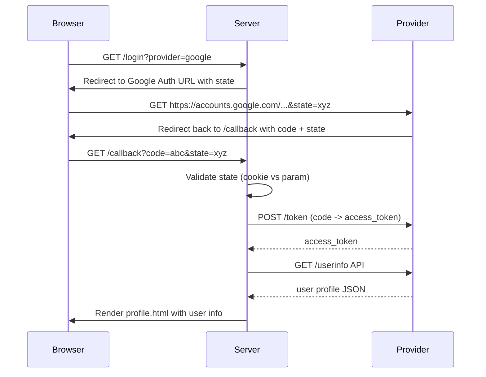

# OAuth2 Social Login Demo (Google, Naver, Kakao)

This is a sample Go application that demonstrates **OAuth2 login** integration with **Google**, **Naver**, and **Kakao** using custom providers. It allows E2E testing through a simple web server and local redirect.

## ✨ Features

- Login with Google, Naver, Kakao
- Fetch user profile info (name, email, gender, picture)
- CSRF protection with OAuth `state`
- Logging middleware for request/response tracking
- Customizable with `.env`-style environment variables

---

## 🔧 Environment Variables

Set the following variables (e.g., using a `.env` or your shell):

```bash
GOOGLE_CLIENT_ID=...
GOOGLE_CLIENT_SECRET=...
GOOGLE_REDIRECT_URL=http://localhost:8080/callback?provider=google

NAVER_CLIENT_ID=...
NAVER_CLIENT_SECRET=...
NAVER_REDIRECT_URL=http://localhost:8080/callback?provider=naver

KAKAO_CLIENT_ID=...
KAKAO_CLIENT_SECRET=...
KAKAO_REDIRECT_URL=http://localhost:8080/callback?provider=kakao
```

> Make sure you have properly registered these redirect URLs in each provider’s developer console.

---

## 🚀 How to Run

```bash
go run main.go
```

Open your browser and visit:

```
http://localhost:8080
```

You can select any of the login providers and test full login flow.

---

## ✅ Login Flow (E2E) - Mermaid Diagram



---

## 📋 Templates

- `templates/home.html`: Login option buttons
- `templates/profile.html`: Profile display (thumbnail style)

---

## 📦 Logging Middleware

The middleware logs:

- Method + Path + Status + Duration
- Request Body (if applicable)
- Response Body

Helps track E2E flows clearly for debugging or demonstration.

---

## 🔐 Notes
- Kakao scopes like `account_email` must be enabled in developer console (동의항목)
- CSRF protection via OAuth state cookie matching

---

## 📸 Example Profile Output

```text
Name: Alice Kim
Email: alice@example.com
Gender: female
```

---

## 📎 References

- Google OAuth: https://developers.google.com/identity/protocols/oauth2
- Kakao Login: https://developers.kakao.com/docs/latest/ko/kakaologin/rest-api
- Naver Login: https://developers.naver.com/docs/login/overview/